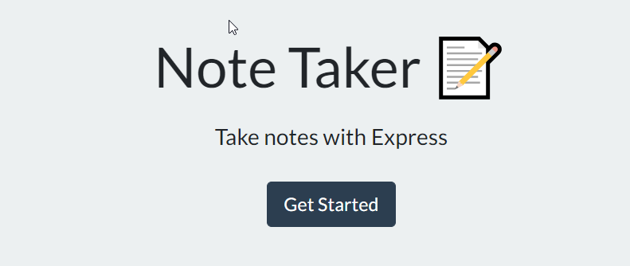

# Note-Taker

This project was designed as a homework assignment for MSU's coding bootcamp. 

This application was created with the use of Javascript, Node.js, Express.js, , and uuid package as well as some html and css.

This projects' code can be found on my github (Link can be found below).

# Table of Contents
1. [Links](#Links)
2. [Project Overview](#projectoverview)
3. [Execution](#Execution)
4. [Contains](#Contains)
5. [Demonstration](#Demonstration)
6. [Future](#Future)

## Links

* [GitHub Repository](https://github.com/CMarcano7/Note-Taker)

* [Heroku](https://morning-chamber-87275.herokuapp.com/)

## Project Overview 

* This project was made so that the user could create and delete notes that will be saved for a later date all while using mainly express.js and node.js.
* Javascript, express.js, node.js, uuid, html, css

## Execution
### Use the Heroku Link above:
> Once at the home page you can just begin by clicking the Get Started button 

> After you can give your note a title and continue on writing your note in the body (if there is already text there or you would like to create a new note, without saving one, you can simply hit the pencil in the top right of the page.)

> After you can save your note by hitting the save icon on the top right of the screen
> You can also delete your notes by clicking the delete icon nex to the saved note titles.

## Contains: 
* Javascript Files
    * server.js
    * htmlRoutes.js
    * apiRoutes.js

* JSON File
  * db.json

* Express.js
    * [Inquirer](https://expressjs.com/)

* UUID.js
    * [uuid](https://www.npmjs.com/package/uuid)

* Find node.js docs [Here](https://nodejs.org/dist/latest-v14.x/docs/api/)

## Demonstration

* Link to demo [Here](https://drive.google.com/file/d/1aUkJaB9iOzerdjeeAr5jMGDpRFFCO5vQ/view)

* MSU BootCamp

## Future

* For the future of this project I would like to give the users the ability to save notes based on a user id and password they can create so that their notes are unique to them.